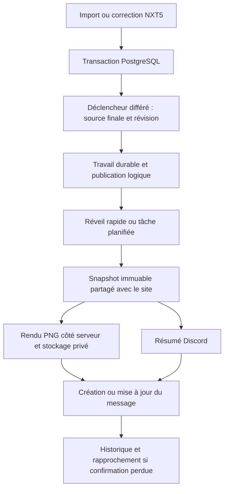

# NXT5 → Discord — installation et exploitation

Version V1 · 15 septembre 2026.

Ce document décrit le code préparé dans ce checkout. Il ne constitue pas une preuve de déploiement en production, de migration appliquée à Neon, d’installation d’un bot ou de publication réelle dans Discord. Les essais de transport automatisés utilisent des réponses simulées ; les transactions et déclencheurs sont exécutés dans PostgreSQL local avec PGlite.

## 1. Bot commun à toutes les équipes

Le bot transforme une game NXT5 en message Discord, PNG et lien vers la bonne équipe/game. Les imports par fichier et par identifiant utilisent le même circuit. Les corrections mettent à jour le message existant ; un réimport sans changement de contenu reste silencieux.

Le produit utilise **une application Discord NXT5 commune à toutes les équipes**. Son propriétaire configure une fois les identifiants, le jeton, le serveur applicatif et les commandes. Chaque responsable d’équipe utilise ensuite le même lien d’invitation, choisit son serveur Discord, relie son équipe NXT5 et configure ses propres salons. Aucune équipe, aucun serveur et aucun salon ne sont inscrits dans une liste centrale préalable ; les responsables d’équipe n’ont pas à créer une application Discord ni à fournir un jeton.

Dans NXT5, le propriétaire ou un capitaine configure les destinations. Discord exige aussi qu’un responsable autorise l’installation et la liaison dans son serveur. Une destination possède un filtre de catégories, l’activation automatique, une option pour les pistes de review et une éventuelle mention de rôle. Par exemple, une équipe peut choisir `#scrims` pour sa catégorie Scrim et `#officiels` pour ses matchs officiels ; une autre choisit librement des salons différents.

Le code permet plusieurs équipes indépendantes, avec **un serveur connecté par équipe, une équipe connectée par serveur et jusqu’à dix salons par équipe**. Les clubs souhaitant plusieurs équipes NXT5 sur un même serveur, ou une équipe diffusant dans plusieurs serveurs, nécessitent une évolution du modèle de connexion et des commandes. Le pilote limité à une équipe et un salon reste une étape de validation technique ; il ne définit pas la population du produit.

L’activation ne publie pas l’historique. Une ancienne game peut être partagée explicitement depuis son aperçu. Une destination manuelle continue à recevoir les corrections d’une game déjà partagée. Ajouter une catégorie ou une destination ne déplace pas silencieusement une publication existante dans un nouveau salon.

Les reviews rédigées par le staff, bilans de session, Tendances hebdomadaires, profils et pools sont des extensions prévues après validation du pilote. Les commandes V1 sont `/nxt connecter`, `/nxt statut`, `/nxt pause`, `/nxt reprendre` et `/nxt aide`. La publication d’une game se fait depuis NXT5 ; aucune commande Discord ne donne accès aux données privées d’une autre équipe.

## 2. Architecture et fichiers



| Responsabilité | Fichier principal |
| --- | --- |
| Modèle commun au site et au bot | [`shared/publications/game-publication.js`](../shared/publications/game-publication.js) |
| Primitives visuelles | [`shared/publications/game-publication-canvas.js`](../shared/publications/game-publication-canvas.js) |
| Rendu serveur | [`publication-render.ts`](../netlify/functions/_lib/publication-render.ts) |
| Migration et déclencheurs | [`20260915_discord_publications.sql`](../database/migrations/20260915_discord_publications.sql) |
| File, claims et reprises | [`discord-queue.ts`](../netlify/functions/_lib/discord-queue.ts) |
| Préparation et livraison | [`discord-worker.ts`](../netlify/functions/_lib/discord-worker.ts) |
| Réveil après une mutation | [`discord-wake.ts`](../netlify/functions/_lib/discord-wake.ts) |
| Client Discord et permissions | [`discord-client.ts`](../netlify/functions/_lib/discord-client.ts) |
| Configuration et signatures | [`discord-config.ts`](../netlify/functions/_lib/discord-config.ts) |
| Commandes HTTP | [`discord-interactions.ts`](../netlify/functions/discord-interactions.ts) |
| Stockage et entretien | [`publication-assets.ts`](../netlify/functions/_lib/publication-assets.ts), [`discord-maintenance.ts`](../netlify/functions/_lib/discord-maintenance.ts) |

### Données persistantes

| Table | Rôle |
| --- | --- |
| `discord_connections` | Liaison équipe/serveur, pause et version de configuration. |
| `discord_link_codes` | Empreinte du code temporaire, émetteur, expiration et consommation. |
| `discord_interaction_receipts` | Identifiant unique d’une commande reçue, état et résultat ; empêche son rejeu. |
| `discord_routes` | Salon, catégories et politique de contenu. |
| `discord_publications` | Identité stable équipe/game/salon, message Discord, révisions et bail commun aux versions. |
| `publication_jobs` | Événement, tentative, prochaine exécution et erreur publique. |
| `publication_snapshots` | Contenu immuable, hash et clé du PNG. |
| `discord_deliveries` | Trace de chaque tentative de transport. |
| `discord_worker_leases` | Concurrence globale du traitement des publications. |

La migration ajoute `matches.publication_revision` et `publication_content_hash`. Le hash de source ignore notamment les UUID de lignes participants, dates d’écriture et statut de review. Les déclencheurs différés examinent les données finales de la transaction : un import annulé n’enregistre aucun travail et une transaction qui modifie dix participants ne produit qu’une révision du contenu final.

Le modèle de publication conserve la différence entre zéro mesuré et information indisponible. Une timeline absente ne produit pas de conclusions sur les combats. Les notes humaines et données de compte ne sont pas reprises dans le snapshot.

## 3. Prérequis

Préparer les éléments suivants avant une activation réelle :

- Un environnement NXT5 déployé, son URL publique HTTPS et son accès Neon.
- Un forfait Netlify autorisant les fonctions en arrière-plan et le stockage Blobs utilisés par le projet.
- Une application Discord avec son compte bot, sa clé publique et son jeton.
- Le serveur pilote, le salon retenu et une personne autorisée à gérer ce serveur.
- Le propriétaire ou capitaine de l’équipe NXT5 correspondante.
- Un environnement local Node.js conforme à `package.json` et un bot de test séparé pour les essais réels.

Les commandes passent par les interactions HTTP. Une connexion Gateway permanente et l’accès privilégié au contenu des messages ne sont pas nécessaires à cette V1. Le serveur répond rapidement à l’interaction, puis termine le travail avec une réponse différée privée. Discord impose une première réponse dans les trois secondes. [Documentation des interactions](https://docs.discord.com/developers/interactions/receiving-and-responding).

## 4. Variables d’environnement

La liste de référence est [`.env.example`](../.env.example). Les secrets doivent rester dans l’environnement serveur, jamais dans une variable `VITE_*`, une capture d’écran, un fichier versionné ou le texte d’un ticket.

| Variable | Valeur et effet |
| --- | --- |
| `DATABASE_URL` | Base Neon du bon environnement. |
| `PUBLIC_SITE_URL` | Origine HTTPS de cette instance NXT5 ; sert aux liens et appels internes. |
| `DISCORD_APPLICATION_ID` | Identifiant de l’application Discord. |
| `DISCORD_BOT_TOKEN` | Jeton du bot, réservé aux Functions. |
| `DISCORD_PUBLIC_KEY` | Clé publique Ed25519, 64 caractères hexadécimaux. |
| `DISCORD_WORKER_SECRET` | Secret aléatoire d’au moins 32 caractères, distinct du secret de session. |
| `DISCORD_PUBLISHING_ENABLED` | `false` par défaut ; coupe-circuit global des publications. |
| `DISCORD_ENVIRONMENT` | `production`, ou `test` avec les ressources dédiées aux essais. |
| `DISCORD_LOCAL_PILOT` | `false` par défaut ; `true` seulement pour un essai local explicite avec `DISCORD_ENVIRONMENT=test`. |
| `CONTEXT` | Repli réservé aux outils/tests locaux. Cette variable de build ne pilote pas les Functions hébergées. |

Les Functions utilisent le contexte fiable `context.deploy.context` fourni par Netlify, isolé par invocation avec `AsyncLocalStorage`. Les contextes `deploy-preview`, `branch-deploy` et un contexte hébergé inconnu masquent les secrets Discord et refusent les mutations, même si le drapeau global est activé. Un site Netlify de test autonome peut utiliser son propre contexte `production`, ses propres variables et `DISCORD_ENVIRONMENT=test`. [Référence du contexte Netlify Functions](https://docs.netlify.com/build/functions/api/).

La configuration requiert l’ensemble des identifiants et secrets attendus. La page d’administration signale les éléments absents sans afficher leurs valeurs. La pause globale n’empêche pas nécessairement la mise en file par une connexion d’équipe restée active ; mettre aussi cette connexion en pause si les nouveaux imports ne doivent pas être enregistrés pour diffusion ultérieure.

### Restriction volontaire des aperçus de déploiement

Un aperçu peut hériter d’une connexion à la base de production. Désactiver son worker ne suffit donc pas : une écriture de game déclenche la file SQL, que le worker de production pourrait traiter plus tard. La barrière de source refuse ces écritures avec HTTP 409 avant authentification, limitation de débit en base ou persistance, en contexte `deploy-preview`, `branch-deploy` ou hébergé inconnu. Elle s’applique même si les variables de build annoncent `production` et si Discord est globalement désactivé.

| Entrée | Mutation protégée |
| --- | --- |
| `matches-import`, `matches-import-file` | Import, réimport, participants et données Riot brutes. |
| `matches-manage` | Corrections de nom, catégories, rôles, side, statut de review et suppression. |
| `match-categories-manage` | Gestion des catégories, notamment leur retrait des games. |
| `players-delete` | Suppression d’un profil, qui modifie les participants par clé étrangère. |
| `teams-delete` | Suppression d’une équipe et des games associées en cascade. |

Les routes de lecture, dont `match-details`, et les appels d’import `previewOnly: true` restent accessibles selon les droits NXT5 habituels. Ces derniers ne sauvegardent aucune game et ne réveillent pas le bot. Les mutations fonctionnent en production et en développement local. Pour essayer le cycle complet, utiliser un **site Netlify de test distinct**, publié dans son contexte `production`, avec **sa propre base Neon**, son bot et son serveur Discord de test, et `DISCORD_ENVIRONMENT=test`. Ne pas utiliser la base de production pour ce pilote isolé.

Les tests `match-source-environment.test.ts` couvrent les six entrées, les cascades, les contextes incohérents, l’absence d’effet DB/Riot/notification après refus, la production sans variable `CONTEXT`, le local et les lectures conservées.

## 5. Préparer le déploiement

1. Installer les dépendances dans un environnement Node.js compatible.
2. Exécuter `npm run verify` et examiner tous les échecs éventuels.
3. Générer les exemples PNG et examiner les cas complets, sans timeline, avec noms longs et side rouge.
4. Vérifier que le bundle Netlify inclut le binaire Linux x64 de `@napi-rs/canvas`, les fichiers Inter et le wordmark indiqués dans `netlify.toml`, avec `npm run discord:check-bundle` après le build Netlify. Un paquet construit sur macOS avec le seul binaire Darwin ne fonctionne pas sur Netlify : privilégier le build Linux du fournisseur ; pour un déploiement local de test, installer aussi la dépendance optionnelle Linux correspondant exactement à la version du moteur.
5. Laisser `DISCORD_PUBLISHING_ENABLED=false` pour le premier déploiement.
6. Appliquer les migrations par le mécanisme du dépôt, avec une sauvegarde appropriée de l’environnement cible.
7. Vérifier l’administration Discord et la présence du marqueur `discord-publications-20260915-v1`.

Commandes locales de vérification :

```sh
npm run verify
node node_modules/vitest/vitest.mjs run src/__tests__/discord-queue.test.ts src/__tests__/match-import-atomic.test.ts
./node_modules/.bin/esbuild tools/benchmark-publication-render.mjs --bundle --platform=node --format=esm --packages=external --outfile=artifacts/discord-render/benchmark-runner.mjs
node artifacts/discord-render/benchmark-runner.mjs artifacts/discord-render
```

Le bundlage du script de benchmark résout ses imports TypeScript ; les bibliothèques natives restent chargées depuis les dépendances installées. Le résultat attendu est le dossier `artifacts/discord-render` et son fichier `benchmark.json`.

La commande `npm run db:migrate` **modifie la base désignée par `DATABASE_URL`**. Dans ce dépôt, le contexte Netlify `production` l’exécute après `npm run verify`. Le registre vérifie le checksum de chaque migration : une migration déjà appliquée ne doit plus être modifiée ; les changements suivants nécessitent un nouveau fichier.

## 6. Créer et installer l’application Discord

### Configuration centrale du bot public NXT5

Cette opération appartient à l’administrateur de NXT5 et se fait une fois pour le service :

1. Créer ou utiliser l’application officielle **NXT5** dans le [portail développeur Discord](https://discord.com/developers/applications).
2. Activer l’installation sur serveur (**Guild Install**) et l’option **Public Bot** pour permettre aux responsables des autres serveurs d’inviter le bot. Le parcours actuel utilise l’installation directe, avec `bot_require_code_grant=false`. [Paramètres d’application Discord](https://docs.discord.com/developers/resources/application).
3. Définir les scopes `bot` et `applications.commands`, avec les permissions de salon détaillées ci-dessous. Le lien d’installation généré par NXT5 laisse le choix du serveur à son responsable. [Installation d’une application](https://docs.discord.com/developers/quick-start/getting-started).
4. Configurer les secrets et l’endpoint d’interactions une fois dans l’environnement NXT5, puis vérifier le PING Discord.
5. Pour l’ouverture à toutes les équipes, enregistrer les commandes globalement avec la commande ci-dessous. Les nouvelles installations disposent alors des commandes sans opération serveur par serveur. [Portée des commandes Discord](https://docs.discord.com/developers/interactions/application-commands).

```sh
node tools/register-discord-commands.mjs --global
```

Cette commande remplace la liste globale des commandes de cette application. Elle est exécutée par l’opérateur NXT5 avec les identifiants de l’application officielle, pas par chaque équipe. Le code inclut déjà ce mode ; sa présence dans ce guide ne signifie pas qu’il a été exécuté.

Le parcours autonome de chaque équipe est : **Installer le bot → choisir le serveur → relier l’équipe avec le code NXT5 → choisir les salons/règles → activer**. Le serveur et les salons de toutes les équipes ne sont pas demandés à l’administrateur NXT5 avant la configuration centrale.

### Validation technique sur une application de test

1. Créer l’application de test dans le [portail développeur Discord](https://discord.com/developers/applications).
2. Créer ou activer le bot de cette application.
3. Reporter l’Application ID, la clé publique et le jeton dans les variables serveur.
4. Renseigner l’Interactions Endpoint URL : `https://VOTRE-INSTANCE/.netlify/functions/discord-interactions`.
5. Vérifier que Discord accepte la validation PING de cet endpoint.
6. Installer l’application sur le serveur pilote à partir du lien fourni dans les réglages NXT5.
7. Vérifier les permissions réelles du bot dans le salon choisi.

Les permissions demandées sont : voir le salon, envoyer des messages, intégrer des liens, joindre des fichiers et lire l’historique. Le bot n’exige pas la permission Administrateur. Une mention de rôle requiert aussi que ce rôle puisse être mentionné ou que le bot dispose de la permission correspondante dans ce salon.

### Enregistrer les commandes

Depuis un shell dont l’environnement contient les identifiants du **bot pilote** :

```sh
node tools/register-discord-commands.mjs --guild=IDENTIFIANT_DU_SERVEUR_PILOTE
```

Cette commande écrit dans Discord : elle remplace la liste des commandes de cette application pour ce serveur. Utiliser une application dédiée à NXT5. Le script ne journalise pas le jeton. L’option `--global` remplace la liste globale de l’application ; la réserver à l’ouverture décidée après le pilote.

### Lier l’équipe

1. Dans l’équipe NXT5, ouvrir les réglages Discord avec le rôle propriétaire ou capitaine.
2. Générer le code temporaire. Il expire après dix minutes et ne fonctionne qu’une fois.
3. Dans Discord, un responsable disposant de Gérer le serveur ou Administrateur lance `/nxt connecter code`.
4. Le backend vérifie la présence du bot, le code et les droits NXT5 encore valides de son émetteur.
5. La connexion arrive en pause. Choisir les salons, catégories, pistes et mentions dans NXT5.
6. Afficher l’aperçu d’une game représentative. Vérifier l’audience, le texte, le PNG et le lien.
7. Activer les publications lorsque les essais d’environnement sont terminés.

Un index PostgreSQL empêche deux équipes de relier simultanément le même serveur. Les identifiants de commandes déjà reçues sont enregistrés pour éviter une seconde exécution lors d’un rejeu de la requête signée.

## 7. Vérifier un pilote réel

Compléter cette liste dans le serveur pilote, puis conserver les liens des messages et les horaires des essais :

- [ ] Import d’une nouvelle game : un message, un PNG et un lien corrects.
- [ ] Fermeture du navigateur après confirmation de l’import : la publication arrive quand même.
- [ ] Réimport identique : aucun message supplémentaire.
- [ ] Correction du résultat, du side ou des rôles : mise à jour du même message.
- [ ] Lecture du PNG dans Discord sur téléphone ; noms longs lisibles et absence de débordement.
- [ ] Game sans timeline : indication explicite, sans conclusion inventée sur les combats.
- [ ] Lien ouvert déconnecté, puis connexion à NXT5 : bonne équipe et bonne game.
- [ ] Catégorie hors règle : aucun envoi dans le salon.
- [ ] Ancienne game : aucune publication lors de l’activation, partage explicite possible.
- [ ] Mention : seulement celle configurée ; une correction ne mentionne pas à nouveau le rôle.
- [ ] Pause, import, reprise : comportement et historique compris par l’opérateur.
- [ ] Permission de joindre des fichiers retirée : erreur visible et reprise après réparation.
- [ ] Retrait d’un message connu depuis NXT5 : retrait effectif et état conservé.
- [ ] Commande sans droits Discord et compte NXT5 d’une autre équipe : accès refusé.

L’objectif initial du plan est 95 % des publications sous deux minutes et 99 % sous cinq minutes après disponibilité des données. Ce sont des objectifs de pilote à mesurer, pas une garantie obtenue par les essais locaux. Le traitement traite normalement quatre travaux par lot et sérialise les lots ; un import massif ou de nombreuses destinations peut augmenter le délai.

Observer le pilote pendant trois à sept jours avant d’ouvrir d’autres équipes. Les métriques à conserver sont : date d’import, disponibilité du travail, première tentative, confirmation Discord, poids de l’image, nombre de tentatives et erreurs. Aucun coût d’IA par publication n’est ajouté par cette architecture.

## 8. Déclenchement, baux et correction

Le réveil rapide utilise `context.waitUntil` après l’enregistrement de la mutation. Il appelle la fonction en arrière-plan avec une requête HMAC. Cette fonction peut attendre jusqu’à huit secondes pour regrouper les corrections ; la réponse d’import n’attend pas ce délai.

Le dispatcher planifié s’exécute chaque minute et ne déclenche un lot que si un travail pertinent est disponible. Il reprend le relais si le réveil rapide échoue ou si `waitUntil` est indisponible. Les fonctions planifiées de Netlify s’exécutent dans le contexte publié prévu par la plateforme. [Documentation des fonctions planifiées](https://docs.netlify.com/build/functions/scheduled-functions/).

Chaque publication logique possède un bail de 180 secondes, renouvelé avant l’appel Discord. Le traitement global possède un bail de quatorze minutes. Le réseau Discord est borné par un délai d’expiration de dix secondes. Le rapprochement planifié examine un candidat toutes les cinq minutes pour rester dans le budget d’une fonction courte. Le travail long utilise une fonction dont le nom se termine par `-background`. [Documentation des fonctions en arrière-plan](https://docs.netlify.com/build/functions/background-functions/).

Juste avant l’envoi, le worker vérifie à nouveau : connexion active, destination active, serveur, catégories, version de configuration, révision courante et propriété du bail. Une correction apparue pendant le rendu empêche l’envoi de l’ancienne préparation. Une correction apparue après le début d’un envoi attend son résultat avant de modifier le même message.

Le hash de publication ignore la date de génération et le numéro de révision, mais inclut la politique de contenu de la destination. Une modification des options de salon suivie d’un partage explicite crée une nouvelle version ; l’ancien snapshot demeure immuable.

## 9. États et gestes d’exploitation

| État | Sens | Geste attendu |
| --- | --- | --- |
| `queued` | Travail conservé, pas encore pris en charge. | Vérifier son ancienneté, la connexion et le dispatcher. |
| `preparing` | Snapshot et PNG en préparation. | Attendre ; un bail expiré sera repris. |
| `sending` | Appel Discord potentiellement en cours. | Ne pas forcer un nouvel envoi. |
| `retry_wait` | Incident transitoire ou limite Discord. | Attendre `available_at`, ou relancer selon les droits proposés. |
| `succeeded` | Confirmation conservée ou contenu déjà identique. | Ouvrir le message depuis l’historique. |
| `superseded` | Version remplacée ou préparation devenue obsolète. | Consulter la version la plus récente. |
| `blocked` | Permissions, contenu ou budget de reprises à corriger. | Réparer la cause et relancer explicitement. |
| `uncertain` | Discord a pu recevoir l’envoi sans confirmation durable. | Rapprocher le message avant toute nouvelle version. |
| `cancelled` | Connexion, règle, game ou publication retirée du traitement. | Examiner le motif ; nouveau partage explicite si approprié. |
| Publication `withdrawn` | Retrait demandé ; aucune nouvelle version autorisée. | Vérifier la confirmation ou la demande de reprise du retrait. |
| Publication `deleted` | La game a été supprimée ; la référence Discord est conservée. | Retirer le message connu si souhaité. |

Les compteurs de tentatives restent croissants afin de conserver l’historique. Une reprise manuelle ouvre un nouveau budget de huit tentatives de traitement sans réutiliser les anciens numéros de livraison. Les réponses 429 respectent le délai fourni par Discord.

### Envoi incertain

1. Consulter l’historique NXT5 et la destination exacte.
2. Attendre le rapprochement automatique. Il cherche la référence du bot dans un historique borné ; l’absence d’un résultat n’autorise pas à recréer le message.
3. Si le message est visible, copier son identifiant et utiliser l’action de rapprochement proposée dans NXT5.
4. Le backend vérifie l’auteur réel du bot, le salon et le pied de message `NXT5 · nxt5:PUBLICATION:REVISION` avant de lier cet identifiant.
5. Une fois l’état résolu, la dernière correction éventuelle peut modifier ce message.

Un identifiant de message d’un autre bot, d’un autre salon ou d’une autre révision est refusé. Un message introuvable ou supprimé ne déclenche jamais automatiquement un POST de remplacement. Si la recherche ne permet pas de conclure, conserver l’état incertain et traiter l’incident avec les références disponibles.

### Pause ou déconnexion

La pause empêche les nouveaux envois et garde les références nécessaires à la reprise. La déconnexion annule les travaux non envoyés et invalide les codes encore utilisables. Le retrait des anciens messages est une action distincte : déconnecter le bot ne supprime pas silencieusement l’historique visible dans Discord.

Une requête déjà reçue par Discord ne peut pas être rappelée par un changement de réglage. Si une game est supprimée pendant cet appel, le worker conserve tout identifiant retourné pour permettre le retrait sans recréer la game.

## 10. Supervision

L’administration NXT5 présente la disponibilité du service, les connexions actives, la file, les blocages, les incertitudes et l’ancienneté du travail en attente. L’historique d’équipe limite son contenu à l’équipe autorisée.

Requêtes de diagnostic en lecture seule, à exécuter dans l’environnement ciblé :

```sql
select status, count(*), min(created_at) as oldest
from publication_jobs
group by status
order by status;

select p.id, p.team_id, p.channel_id, p.message_id, p.state,
       p.published_revision, p.desired_revision, p.uncertain_since
from discord_publications p
where p.state in ('sending', 'uncertain', 'blocked')
order by p.updated_at;

select j.id, j.source_revision, j.attempts, j.available_at,
       j.last_error_code, j.last_error
from publication_jobs j
where j.status in ('blocked', 'retry_wait', 'uncertain')
order by j.updated_at desc
limit 100;
```

Prioriser les incidents suivants : file qui vieillit sans tentative, augmentation des états incertains, erreurs 401 du bot, erreurs 403 d’un salon, échecs répétés de rendu et entretien tronqué plusieurs jours de suite. Les journaux doivent conserver les identifiants et codes utiles, pas les secrets, tokens d’interaction ou corps privés complets.

## 11. Conservation et nettoyage

La maintenance planifiée quotidienne déclenche sa fonction en arrière-plan. Elle peut fonctionner même lorsque les publications sont globalement suspendues, dès lors que l’environnement de production est configuré.

- PNG : fenêtre de trente jours, sous réserve des publications encore en traitement ou incertaines.
- Objets Blobs sans référence en base : délai de grâce d’un jour avant nettoyage.
- Anciennes tentatives et versions terminées : nettoyage après quatre-vingt-dix jours, en conservant les références encore nécessaires.
- Codes de liaison : suppression après expiration et délai de grâce d’un jour.
- Reçus de commandes Discord : sept jours, sans conservation du token d’interaction.
- Message courant, dernière révision publiée et envois incertains : conservés pour les corrections, le rapprochement et le retrait.

Le nettoyage des images ne supprime pas un message Discord. L’endpoint d’asset contrôle les droits NXT5 et peut régénérer une image conservée sous forme de snapshot selon les conditions du code. Une URL CDN Discord signée ne doit pas servir de seule archive. Les salons qui partagent la même game et les mêmes options réutilisent le PNG. Au-delà de 3 Mio, l’aperçu et l’envoi se replient sur le texte et le lien NXT5 ; il s’agit d’une limite applicative commune, inférieure au plafond du transport Discord.

Surveiller les opérations, le volume et la durée de conservation réels. Les ressources d’un site de test doivent utiliser une base et un espace Blobs séparés de la production.

## 12. Retour arrière et restauration

### Retour à une version applicative précédente

1. Désactiver les publications avec `DISCORD_PUBLISHING_ENABLED=false`.
2. Mettre les connexions concernées en pause si les nouveaux imports ne doivent pas alimenter la file.
3. Examiner les envois déjà `sending` ou `uncertain` et conserver leurs références.
4. Revenir au déploiement applicatif validé.
5. Conserver les tables et données de la migration Discord : elles sont nécessaires au diagnostic et à une reprise sans doublons.
6. Ne pas remettre arbitrairement tous les travaux en `queued` et ne pas effacer les `message_id`.

La migration est additive. Un retour du code ne doit pas être accompagné d’un effacement improvisé du registre ou des tables. Les déclencheurs restent présents tant que la migration reste en place ; la pause des connexions contrôle leur production de nouveaux travaux de publication.

### Restauration d’une sauvegarde Neon

1. Garder le coupe-circuit global fermé avant et pendant la restauration.
2. Identifier l’heure de la sauvegarde et la période dont les confirmations Discord peuvent manquer.
3. Comparer les messages réellement visibles dans les salons aux références de la base restaurée.
4. Traiter comme incertaine toute création potentiellement reçue après la sauvegarde et avant l’incident.
5. Restaurer les snapshots et références manquants depuis les journaux ou exports disponibles, puis rapprocher les messages vérifiables.
6. Si la sauvegarde a perdu à la fois l’identifiant et le snapshot nécessaires, effectuer une revue opérateur avant réactivation ; cette V1 ne reconstruit pas automatiquement tout l’historique Discord.
7. Réactiver une équipe pilote, contrôler les premiers résultats, puis reprendre progressivement.

Un état restauré `queued` ne prouve pas qu’un message n’a jamais été envoyé. Un reset massif des baux ou des statuts peut produire des doublons : la reprise normale des préparations et le rapprochement des envois ont des règles différentes.

## 13. Preuves locales et critères de fin

Les essais automatisés couvrent notamment :

- Transaction finale d’import, rollback après exécution d’un déclencheur et réimport identique.
- Corrections de side et participants ; ancienneté et catégories des games.
- Accès manuel explicite et version d’aperçu devenue obsolète.
- Claims concurrents, baux expirés, ordre des versions et blocage d’un envoi incertain.
- POST initial puis PATCH du même message, sans nouvelle mention de rôle.
- Correction pendant le rendu, pause pendant la préparation et perte de confirmation réseau ou SQL.
- Refus des identifiants de messages ne correspondant pas au bot, salon et pied attendus.
- Reprise manuelle avec compteurs de tentative monotones.
- Changement de politique d’une route sans modification de la game : nouveau snapshot et nouveau hash.
- Retrait/recréation d’une règle de salon sans création d’un second message.
- Rejeu de commande et concurrence de liaison au même serveur.
- Réveil sans attente de la réponse d’import et conservation du travail si le réveil échoue.

Les suites ciblées vérifient aussi le retrait réessayable, le réemploi et le nettoyage des PNG, les permissions par équipe, le rejeu des commandes et la suppression d’une game pendant une création dont la confirmation se perd. La vérification complète du dépôt et les preuves de rendu sont consignées dans le bilan de livraison associé à cette version.

Le benchmark local utilise des données synthétiques, pas des données d’une équipe réelle. Le fichier [`artifacts/discord-render/benchmark.json`](../artifacts/discord-render/benchmark.json) contient le runtime, les dimensions, le poids, le temps et la mémoire mesurés. Il ne mesure pas le démarrage à froid de Netlify, la latence de Neon, le réseau Discord ni le coût du forfait.

La V1 est prête à ouvrir après : contrôles du dépôt réussis, bundle serveur validé sur la cible, migration appliquée à l’environnement choisi, configuration du bot complète, liaison de l’équipe et du salon pilote, essais réels de la section 7 terminés, et responsabilité d’exploitation attribuée. Le code seul ne remplace pas ces preuves d’installation.

## 14. Suite après le pilote

Décider des extensions à partir des usages observés : reviews approuvées, bilans de session, bilans hebdomadaires, profils, pool, regroupement en fils et amélioration du débit. Chaque nouveau type de publication doit conserver le même contrat de qualité des données, d’audience, de snapshot immuable et de reprise.

Séparer le rendu dans un service spécialisé seulement si les mesures sur l’environnement réel le justifient. Le modèle partagé et la file persistante permettent cette évolution sans changer la signification des publications.
