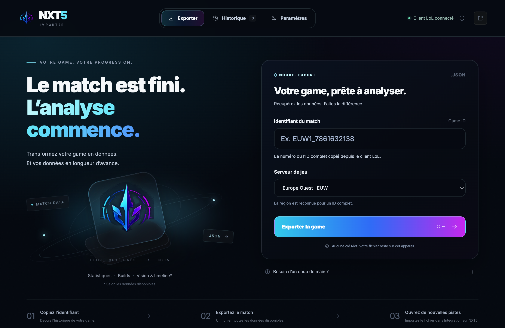

# NXT5 Importer 0.3.3

- La fenêtre d’enregistrement réutilise le dossier du dernier export réussi, y compris après fermeture et réouverture de l’application.
- Une annulation ou un échec d’enregistrement conserve le dossier précédent. Si ce dossier n’existe plus, la fenêtre propose Téléchargements.

# NXT5 Importer 0.3.2

*Aperçu Electron avec connexion client simulée pour la validation.*

- Alignement sur la direction artistique du site : fond bleu nuit, surfaces bleu-encre, textes clairs et accents cyan.
- Reprise du dégradé cyan/bleu/fuchsia des boutons du site, de ses bordures, rayons et états de focus.
- Typographie Inter sur toute l’interface ; retrait de Space Grotesk et des teintes lavande des textes et panneaux.

# NXT5 Importer 0.3.1

- Nouvelle composition esport premium : navigation horizontale, noir profond et accents violet/cyan.
- Titres Space Grotesk et texte Inter, avec polices embarquées pour un affichage cohérent hors ligne.
- États de connexion et d’export plus lisibles, confirmations et erreurs visibles dans le contexte de l’action.
- Interface et états adaptés à la taille minimale de fenêtre, avec navigation clavier et animations réduites selon les préférences système.

# NXT5 Importer 0.3.0

## Interface

- Nouvel espace desktop sombre avec navigation Exporter, Exports récents et Paramètres.
- État du client LoL, instructions contextuelles, validation du Game ID et reconnaissance de région.
- Progression par étape, annulation des requêtes et confirmation détaillée du fichier enregistré.
- Historique local de 30 exports avec recherche, accès au fichier et réexport.
- Adaptation aux petites fenêtres, navigation clavier, annonces accessibles et respect des préférences de réduction des animations.

## Fiabilité

- Vérification de l’identité du match et de sa région avant tout enregistrement, sans recherche silencieuse sur un autre serveur.
- Repli vers le client local pour les IDs complets et numériques ; chemin personnalisé via sélecteur natif.
- Délais maximaux, requêtes annulables, catalogue champions mutualisé et dégradation contrôlée hors ligne.
- Correction des défaites représentées en texte, des rôles support et des statistiques locales conservées.
- Timeline facultative, contrôlée et enregistrée une seule fois ; jalons non observés laissés absents.
- Écriture atomique des fichiers et préférences ; limite de taille compatible avec l’import du site.
- Un export à la fois, validation des échanges entre interface et moteur et ouverture limitée aux liens autorisés/fichiers de l’historique.

## Distribution

- Version installée lisible hors ligne, état de vérification de mise à jour distinct.
- Téléchargements Windows, Mac Intel et Mac Apple Silicon ; sélection exacte de la version et de l’architecture.
- Tests desktop obligatoires avant compilation dans GitHub Actions.

Les essais automatisés utilisent des services Riot/NXT5 et un client LoL simulés. Une partie réelle avec un client Riot connecté reste à vérifier manuellement sur Windows et macOS.
